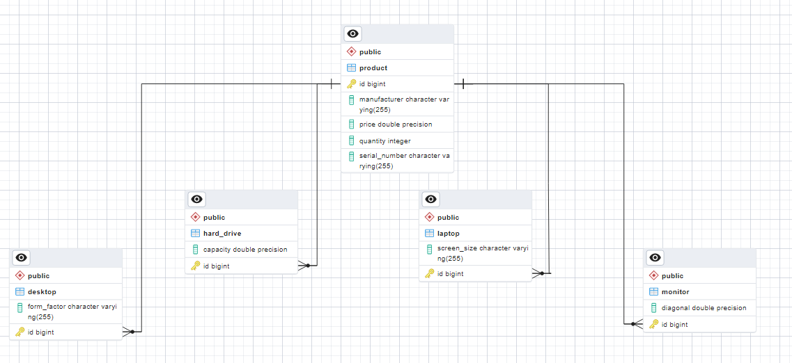
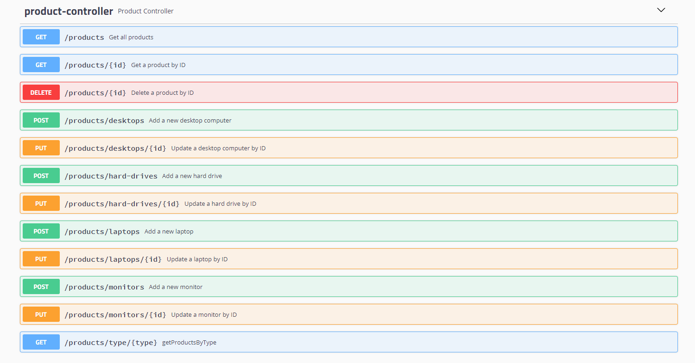

# RESTfull API для Компьютерного магазина.
Содержит все CRUD операции, позволяющие:
1. Добавлять товар.
2. Редактировать товар.
3. Просмотривать все существующие товары по типу.
4. Просмотривать товар по идентификатору.
5. Удалять товар по идентификатору.

---
# Оглавление
- [Описание](#Описание)
- [Локальный запуск](#Как-запустить-локально)
- [База данных](#База-данных)
- [Интерактивная документация, тест REST-API](#API)

___
## Описание:
Магазин, торгующий компьютерами и комплектующими со следующим типом товаров:
1. Настольные компьютеры
2. Ноутбуки
3. Мониторы
4. Жесткие диски

Каждый товар имеет следующие свойства:
1. номер серии
2. производитель
3. цена
4. количество единиц продукции на складе

Дополнительные свойства:
1. Настольные компьютеры имеют форм-фактор: десктопы, неттопы, моноблоки
2. Ноутбуки подразделяются по размеру: 13, 14, 15, 17 дюймовые
3. Мониторы имеют диагональ
4. Жесткие диски имеют объем

____
## Как запустить локально:

Для того, чтобы запустить проект локально вам необходимы JDK от 8 версии, система контроля версий git, сборщик проектов Maven.

Скачать проект можно используя git bash:

    git clone https://github.com/NikolaiMagritte/computer-store-api.git

Далее, посредством Apache Maven необходимо собрать проект, используя команду:

    mvn clean install

Запуск проекта:

    java -jar ComputerStoreAPI-1.0-SNAPSHOT.jar

____
## База данных:
В качестве базы данных используется in memory database H2.

Структура базы данных в виде ER-диаграммы:
<h2 align="center" style="margin: 0; padding: 0;">

</h2>

Для взаимодействия с консолью H2, перейдите по ссылке и нажмите connect:

    http://localhost:8080/h2-console/
____
## API:
К данному проекту подключены библиотеки Swagger для автоматической генерации документации по реализованному API и для удобства его тестирования.
<h2 align="center" style="margin: 0; padding: 0;">

</h2>

Для просмотра документации необходимо перейти по ссылке:

    http://localhost:8080/swagger-ui.html

Протестировать REST-API можно на странице swagger, либо в Postman.

Скачать экспортированный JSON из Postman можно по этой ссылке:

    https://disk.yandex.ru/d/HQrVO-xJ_407pg
